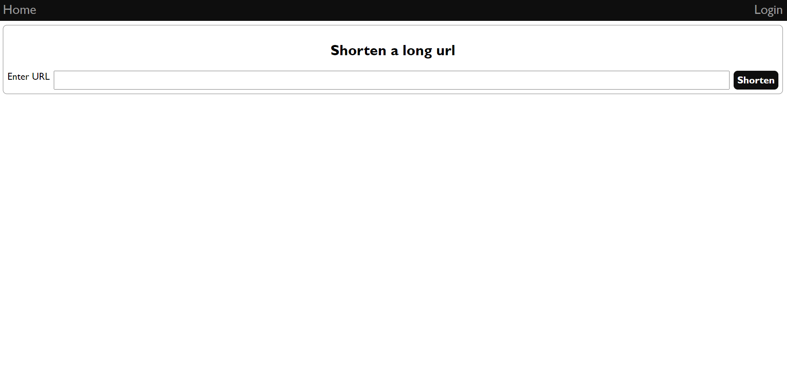

# Authenticated URL Shortener Using node.js

** Live Preview - https://shorturl-s42i.onrender.com/ **



### 1, Info

```
Authenticated URL Shortener using MERN Stack.
Frontend         => React
State Management => Redux
Backend          => Node.js
Database         => MongoDb
 Styling using Scss [Css Preprocessor ].
```

```
Auth done using json web token
Only Authenticated User [Logged User] can access ShortUrl
```

### 2,Predefined User [For Login]

user = > author@gmail.com  
password = > 123456

user = > itadori@gmail.com  
password = > 123456

### 3, Steps

**First Commit**

```
 Create a react app using vite with typescript.
 Implement React-Router since we need multiple screen for the URL Shortener Authentication.
 Create Custom Component which are used as different screen.
 Styling using Scss [Css Preprocessor ].
```

**Second Commit**

```
Setup Backend.
Setup Proxy.
Install Package [express, dotenv ,cors, nodemon, concurrently].
```

**Third Commit**

```
Setup MongDb Database [Atlas] .
Hash password on the userData [predefined User]
Setup User Model
Setup Seed File
Add Script to Run seedFile
Install Package [mongoose, colors, bcrypt].
```

**Fourth Commit**

```
Setup Routes and controller for API [Best Practice] .
Create Custom error handler
Create Custom Async handler
Fetch data from database
Test using postman [get request]
```

**Fifth Commit**

```
Create jsonwebtoken and store it in cookie
Create protectionMiddle [later use]
Create login route [email and password validation and save the user._id as cookie]
Create register route [save the user._id as cookie]
Create user logout [Clearing the cookie]
Install Package [jsonwebtoken,cookie-parser].
```

**Sixth Commit**

```
Setup redux [store and provider]
Create UserApi [login,register,logout]
Create UserSlice [loginCredentials,registerCredentials,logoutCredentials]
Change home screen [urlShorter]
Create Header Component
Create Footer Component
Install Package [react-redux, @reduxjs/toolkit].
```

**Seventh Commit**

```
Login functionality
Header Component Change [rebase]
Install Package [react-toastify].
```

**Eight Commit**

```
Register and Logout functionality
```

**Ninth Commit**

```
[Logic
 1, POST
  We save the user input in the database using a post route
  Then we create a random id [shortid] for that link [shortURL] [placeholder]
 2, GET /:id
   Working of shortURL
   We will find the model of shortUrl [placeholder] with the req.params.id [dynamic route]
   Then redirect to the correctUrl [longUrl]
 3, GET /
    fetch logged in user shortUrl data
    [Frontend Implemented in Tenth Commit ]
    [Backend Second Part : Implemented in Eleven Commit ]
 ]
Backend Implementation ShortUrl [Model, Routes, Controller]
Install Package [valid-url,shortid].
```

**Ten Commit**

```
Frontend Implementation ShortUrl [Redux API, mutation and query on Home-screen]
Backend : ProtectedRoute on ShortUrl [Only if user Login [Authentication] is done, api will be called]
Responsive Table to store the ShortUrl data
Minor Style Changes and responsive fix
```

**Eleven Commit**

```
ShortUrl post route change [shortUrlController]
add edge case [same link for different user if the link doesn't already exist]
```

**Twelve Commit**

```
Bug Fix : Automated Re-fetching [Redux]
```

**Thirteen Commit**

```
Code Cleanup
Style Change
```

**Fourteen Commit**

```
To Deploy for Production and Host in render
Change Code in server.js
Add Build script in root package.json
Test Build Setting [see if dist folder is created in frontend]
 1, by setting .env as production
 2, npm run build
 3, browser open the backend localhost [http://localhost:8080]
```

**Fifteen Commit**

```
Update Readme
```

**Sixteen Commit**

```
Bug Fix : Redux slice initialState name [auth slice]
```

**Seventeen Commit [Additional Fix ]**

```
Update Fav Icon
UI Fix         : on UrlShorter Screen
Regex Update   : Password
Frontend Auth  : Register error message [email,password]
```
